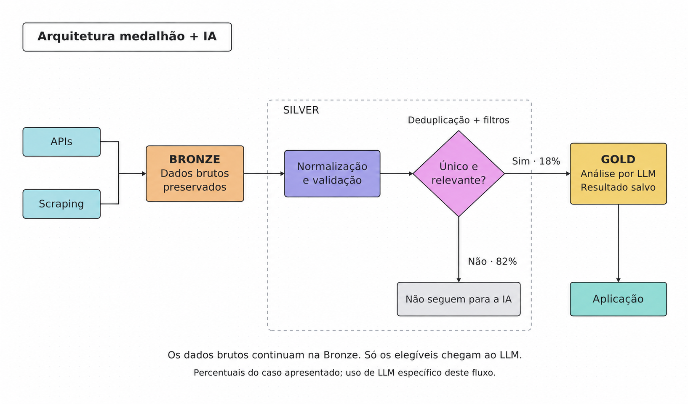

# JobHunter

Sistema modular de descoberta e triagem de oportunidades: encontra, filtra,
entende e entrega — para que a pessoa receba menos ruído e mais contexto para
decidir.

> Este repositório contém a landing page pública do JobHunter. A aplicação de
> coleta e análise permanece privada.

## O produto

O JobHunter transforma uma busca espalhada em um fluxo único. Perfis são
modulares: os critérios mudam conforme a área, o momento e o objetivo de cada
pessoa. A interface explica esse processo com um túnel 2D guiado por scroll,
cards de perfis e uma prévia de entrega inspirada em notificações reais.

As notificações mostradas no site são demonstrações ilustrativas; não
representam vagas abertas.

## Como funciona

### Arquitetura medalhão + IA

O diagrama abaixo documenta o fluxo e a separação entre dados brutos,
tratamento determinístico e análise por IA. O percentual é uma observação de
uma rodada histórica específica (não um benchmark universal):

Em um conjunto de rodadas observado, 82% dos itens foram eliminados antes da
IA por não serem únicos ou relevantes para o perfil ativo. Os elegíveis
seguiram para a análise contextual e tiveram o resultado salvo.

## Interface

### Hero: do ruído ao fluxo

### Perfis modulares

### Entrega com contexto

## Evidências de eficiência

As métricas abaixo foram calculadas a partir de um conjunto de rodadas do
sistema:

- **82%** de redução observada antes da análise por IA em uma rodada histórica;
- **78%** de itens reaproveitados sem nova chamada de IA em um fluxo observado;
- **42%** menos tempo entre rodadas do mesmo perfil após o reaproveitamento.

O foco é simples: filtros baratos removem o que não faz sentido e deixam a IA
concentrar esforço nas oportunidades que merecem contexto.

## Stack do JobHunter

- **Playwright** para automação e coleta das oportunidades;
- **Python** para orquestração, tratamento e processamento dos dados;
- **Gemini Flash-Lite (`gemini-flash-light`)** para análise contextual das
  oportunidades elegíveis;
- arquitetura **Medallion** em Bronze/Silver/Gold, com normalização, validação,
  deduplicação e rastreabilidade;
- arquitetura preparada para aderir a outros modelos de **LLM**;
- perfis modulares, reuso de resultados e entrega contextualizada via bot do
  Telegram.

### Stack da interface demonstrativa

- React 19 + TypeScript, vinext (App Router) e Vite;
- CSS modular, fontes locais e suporte a `prefers-reduced-motion`;
- Cloudflare Worker/Sites para publicação da landing page.

## Licença e escopo

Este é um projeto de portfólio e demonstração de produto. O código de coleta,
as credenciais e os dados operacionais do JobHunter não fazem parte deste
repositório público e estão disponíveis somente no repositório privado.

ByGuto.
